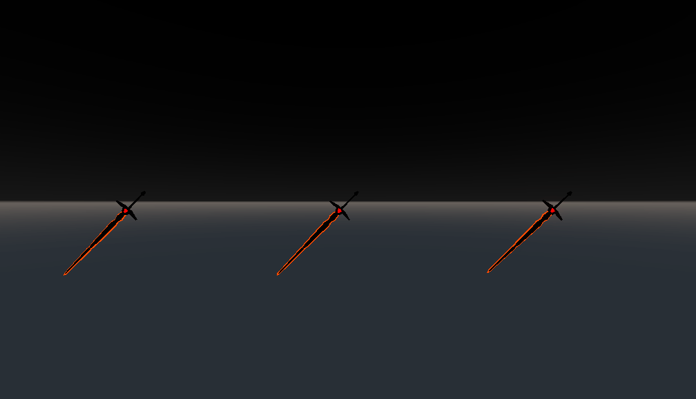

# Godot-Sword-Slash-with-Visual-Shader
How to make a Sword Slash or Sword Swing effect on Godot using Visual Shader
Works on GLES3 and GLES2
There are 3 different versions

Video tutorial: https://youtu.be/gX5U06yqCcM
Written tutorial: https://alphinalbukhari.blogspot.com/2020/03/godot-tutorial-how-to-make-sword-slash.html
